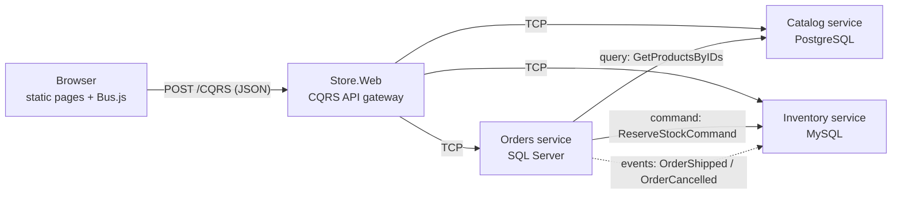

# Store Demo

A small storefront split into three microservices behind one CQRS gateway. The web app serves static HTML and JavaScript pages that call the gateway with the Zerra front end scripts (`Bus.js`). Each service is a bounded context with its own data store, and it creates and seeds that store on startup.



Traffic between the gateway and the services, and between services, uses the binary serializer over TCP, encrypted with a shared key. Browsers only talk JSON to the gateway.

## Projects

| Project | Role |
|---|---|
| `Store.Web` | ASP.NET app. Serves `wwwroot` and hosts `UseCqrsApiGateway("/CQRS")`. Its bus has no handlers, it forwards everything to the services. |
| `Store.Catalog.Domain` | Catalog contracts: `ICatalogQueryHandler`, `ICatalogCommandHandler`, commands, and models. |
| `Store.Catalog.Service` | Products and categories, PostgreSQL store. |
| `Store.Inventory.Domain` | Inventory contracts. `IStockReservationHandler` is for service-to-service use only. |
| `Store.Inventory.Service` | Stock levels, reservations, and the movement log, MySQL store. Subscribes to order events. |
| `Store.Orders.Domain` | Orders contracts, plus the events Orders publishes and `IOrderEventHandler` for subscribers. |
| `Store.Orders.Service` | Customers and orders, SQL Server store. Coordinates Catalog and Inventory. |
| `Store.Common` | Shared plumbing: settings, console loggers, `DomainException`, data store setup, and the seed product IDs. |

Each service follows the same layout:

- `Handlers/`: the bus handlers. Command handlers check the rules, throwing `DomainException` with a message for the user, then read and write data models through `IRepo` and publish events. Query handlers read data models and map them to the contract models.
- `Data/`: data models, the `DataContextSelector`, the store provider, and the seeder.

## Running

**Visual Studio (17.11 or later):** pick the **Store Demo** launch profile in the startup project dropdown and press F5. It starts the three services and the web app, and the browser opens `http://localhost:5100`. The profile is in `Zerra.slnLaunch` at the repository root.

**Script:**

```powershell
.\Demo\Store\start-store.ps1            # use the databases when they're reachable
.\Demo\Store\start-store.ps1 -InMemory  # skip the databases
```

It builds the four projects and starts each one in its own window.

**By hand:** `dotnet run` each of `Store.Catalog.Service`, `Store.Inventory.Service`, `Store.Orders.Service`, and `Store.Web`, in any order. Clients connect on first use.

## Data stores

Each service's `DataContextSelector` lists its database first and an in-memory store second. At startup the service checks whether the database is reachable. If it is, code-first generation creates the database and tables, and later adds columns. If not, the service logs why and runs in memory, reseeding on every start. The Overview page shows which store each service is using.

| Service | Database | Default connection |
|---|---|---|
| Catalog | PostgreSQL | `Host=localhost;Port=5432;User ID=postgres;Password=password123;Database=zerrastorecatalog` |
| Inventory | MySQL | `Server=localhost;Port=3306;Uid=root;Pwd=password123;Database=ZerraStoreInventory` |
| Orders | SQL Server | `Data Source=.;Initial Catalog=ZerraStoreOrders;Integrated Security=True` |

Seeders only run against an empty store, so data in a database survives restarts. Drop a demo database to reseed it.

## Settings

All settings have defaults in `Store.Common/StoreSettings.cs` and can be overridden with environment variables.

| Variable | Default |
|---|---|
| `STORE_IN_MEMORY` | not set. Set it to `true` to skip the databases. |
| `STORE_CATALOG_URL`, `STORE_INVENTORY_URL`, `STORE_ORDERS_URL` | `localhost:9101`, `localhost:9102`, `localhost:9103` |
| `STORE_CATALOG_POSTGRESQL`, `STORE_INVENTORY_MYSQL`, `STORE_ORDERS_MSSQL` | the connection strings above |
| `STORE_SHARED_KEY` | the demo key for the TCP encryption |

## Things to try

- Order 3 Standing Desks. Only 2 are in stock, so Inventory rejects the order. The error comes back through Orders and the gateway to the page.
- Place an order and open Inventory: the units are reserved. Ship the order and Inventory handles `OrderShippedEvent` by taking them off the shelf, or cancel it and `OrderCancelledEvent` releases them.
- Discontinue a product, then try to order it.
- Add a product, restock it, then order it.
- Stop one service and use the pages to see how the failure surfaces.

## Where to look

| Feature | Where |
|---|---|
| Gateway for browsers | `Store.Web/Program.cs` |
| Service host: handlers, TCP server, clients to other services | `Store.*.Service/Program.cs` |
| Query called from another service | `OrdersCommandHandler` calls `ICatalogQueryHandler.GetProductsByIDs` |
| Command with a result, awaited across services | `PlaceOrderCommand`, and `ReserveStockCommand` from Orders to Inventory |
| Events between services | Orders publishes through `AddEventProducer<IOrderEventHandler>`, Inventory handles them in `OrderEventHandler` |
| Repository with a store per service and in-memory fallback | `Store.*.Service/Data/*DataContext.cs`, `Store.Common/Data/DataStoreSetup.cs` |
| Relations with `Graph` and partial updates | `CatalogQueryHandler` (product with category), `OrdersQueryHandler` (order with customer and lines), `CatalogCommandHandler` and `OrdersCommandHandler` (updates limited to the changed columns) |
| Service injection | `IDataStoreInfo` added to `BusServices`, read by the `GetDataStoreName` queries |
| Browser calls | `Store.Web/wwwroot/js/*.js`, using the generated `JavaScriptModels.js` |

## Regenerating the JavaScript models

`Store.Web/wwwroot/js/JavaScriptModels.js` is generated from the contracts in this folder by `JavaScriptModels.tt`, which uses `Front End Scripts/Binaries/Zerra.T4.dll`. Visual Studio runs the template when it's saved. The output is committed so the site runs without it.

## Simplifications

This is a demo, so some things a production system needs are left out:

- The gateway has no `ICqrsAuthorizer` and allows every origin. See [Security](../../docs/Security.md) and [Zerra.Web](../../docs/ZerraWeb.md).
- Events are published after the order is saved, without an outbox. If Inventory is down when an order ships, the order is still marked shipped and the reservation isn't settled.
- Inventory serializes stock changes with an in-process lock, which only works for a single instance.
