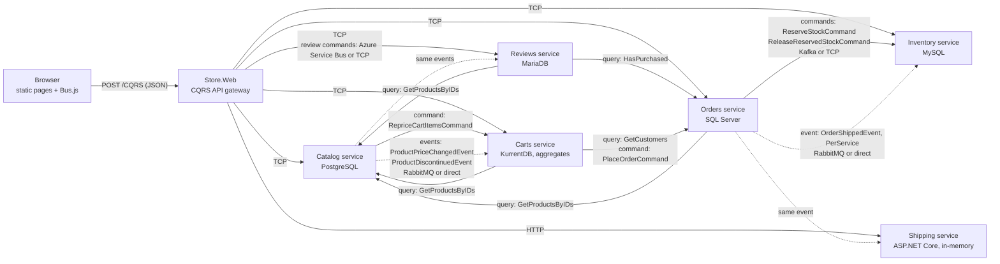

# Store Demo

A small storefront split into seven microservices, one of them the CQRS gateway the other six sit behind. The web app serves static HTML and JavaScript pages that call the gateway with the Zerra front end scripts (`Bus.js`). Each service is a bounded context with its own data store (or none, by design), and it creates and seeds that store on startup.



Traffic between the gateway and most services, and between services, uses the binary serializer over TCP, encrypted with a shared key. Shipping is hosted inside ASP.NET Core, so its traffic is the same serializer and encryption over HTTP instead. Three flows go through a message broker when it's running, one per broker, and fall back to the direct route when it isn't (see [Message brokers](#message-brokers)). Browsers only talk JSON to the gateway.

## Projects

| Project | Role |
|---|---|
| `Store.Web` | ASP.NET app. Serves `wwwroot` and hosts `UseCqrsApiGateway("/CQRS")`. Its bus has no handlers, it forwards everything to the services. |
| `Store.Catalog.Domain` | Catalog contracts: `ICatalogQueryHandler`, `ICatalogCommandHandler`, commands, and models, plus the events it publishes and `ICatalogEventHandler` for subscribers. |
| `Store.Catalog.Service` | Products and categories, PostgreSQL store. On a price change it commands Carts to reprice and publishes an event so every Carts replica drops its cached product. |
| `Store.Inventory.Domain` | Inventory contracts. `IStockReservationHandler` is for service-to-service use only. |
| `Store.Inventory.Service` | Stock levels, reservations, and the movement log, MySQL store. Reserving and releasing arrive as commands from Orders; shipping arrives as `OrderShippedEvent`, subscribed `PerService` so one replica settles the reservation. |
| `Store.Orders.Domain` | Orders contracts: `IOrdersQueryHandler`, `IOrdersCommandHandler`, commands, and models, plus `OrderShippedEvent` and `IOrdersEventHandler` for subscribers. |
| `Store.Orders.Service` | Customers and orders, SQL Server store. Coordinates Catalog and Inventory, and announces `OrderShippedEvent` for Inventory and Shipping to act on. |
| `Store.Shipping.Domain` | Shipping contracts: `IShippingQueryHandler`, `IShippingCommandHandler`. |
| `Store.Shipping.Service` | Tracks shipments. Hosted inside ASP.NET Core over HTTP/Kestrel instead of the raw TCP the other services use, and needs no database, it holds state in memory. Subscribes to the Orders service's `OrderShippedEvent`, `PerService` so one replica creates the shipment. |
| `Store.Reviews.Domain` | Reviews contracts: `IReviewsQueryHandler`, `IReviewsCommandHandler`. |
| `Store.Reviews.Service` | Product ratings and comments, MariaDB store. Calls Catalog for the product's name and Orders to mark a review a verified purchase, and subscribes to the Catalog's product events to drop its cached copy. |
| `Store.Carts.Domain` | Carts contracts. `ICartRepricingHandler` is for service-to-service use only. The aggregate's own events are not here, they live with the aggregate in the service. |
| `Store.Carts.Service` | One shopping cart per customer, event sourced in KurrentDB. Commands rebuild the cart aggregate from its events and append new ones, no tables and no `IRepo`. Checking out places the order through Orders. Takes the Catalog's reprice command and appends the new price to the carts holding the product, and keeps a per-instance product cache that the Catalog's events drop entries from. |
| `Store.Common` | Shared plumbing: settings, console loggers, `DomainException`, data store setup, the messaging description, and the seed product and customer IDs. |

Each service follows the same layout:

- `Handlers/`: the bus handlers. Command handlers check the rules, throwing `DomainException` with a message for the user, then read and write data models through `IRepo` and publish events. Query handlers read data models and map them to the contract models.
- `Data/`: data models, the `DataContextSelector` (or, for Shipping, a plain memory-only context), the store provider, and the seeder.

Carts is the exception. It stores events instead of rows, so it has no data models or store provider. It has an `Aggregates/` folder with `CartAggregate`, an `AggregateRoot` whose `On` methods apply each event to the cart. Its handlers build the aggregate on the event store themselves (see [Where to look](#where-to-look)).

## Tests

Each service has an xUnit test project next to it, `Store.Catalog.Test` through `Store.Carts.Test`, that tests its query and command handlers, plus `CartAggregate` in Carts. None of them needs a database, a message broker, or another service running:

- Each project's `*TestBus` builds a bus the way the service's `Program.cs` does, with `Bus.New` and `AddHandler`. The handlers read their repo and services from the bus context, the same as they do in the service.
- The repo is the service's own store providers on the in-memory store, the same as the **In Memory** launch profile. Each test hands the providers a new data context, and a new in-memory context is a new, empty store, so every test starts from nothing and no test sees another's rows. The services themselves use the parameterless constructor, which shares one context per type. Carts gets a new in-memory event store per test.
- The other services a handler calls or messages are small fake handlers added to the same bus, so the handler under test calls `Bus.Call<ICatalogQueryHandler>()` or dispatches a command as it normally would, and the test checks what the fake received.

Run them from Visual Studio's Test Explorer, or build a project and run its exe, e.g. `Demo\Store\Store.Carts.Test\bin\Debug\net10.0\Store.Carts.Test.exe`.

## Running

**Visual Studio (17.11 or later):** pick the **Store Demo (In Memory, Direct Messaging)** launch profile in the startup project dropdown and press F5. It starts all seven services with `STORE_IN_MEMORY` and `STORE_DIRECT_MESSAGING` set, so no databases or message brokers are needed, and the browser opens `http://localhost:5100`. **Store Demo (Databases, Message Brokers)** starts them the same way but uses the databases and message brokers when they're reachable. The profiles are in `Zerra.slnLaunch` at the repository root, and each uses the profile with the same name in every project's `Properties/launchSettings.json`. "In Memory, Direct Messaging" is listed first, so it's each project's default.

**Script:**

```powershell
.\Demo\Store\start-store.ps1                    # use the databases and message brokers when they're reachable
.\Demo\Store\start-store.ps1 -InMemory          # skip the databases
.\Demo\Store\start-store.ps1 -DirectMessaging   # skip the message brokers
```

It builds the seven projects and starts each one in its own window.

**By hand:** `dotnet run` each of `Store.Catalog.Service`, `Store.Inventory.Service`, `Store.Orders.Service`, `Store.Shipping.Service`, `Store.Reviews.Service`, `Store.Carts.Service`, and `Store.Web`, in any order. Clients connect on first use. That uses the default "In Memory, Direct Messaging" profile, add `--launch-profile "Databases, Message Brokers"` to use the databases and message brokers.

**Native AOT:** every project (including the two ASP.NET Core ones, `Store.Web` and `Store.Shipping.Service`) sets `<PublishAot>true</PublishAot>`. Two scripts mirror `start-store.ps1`:

```powershell
.\Demo\Store\publish-store-aot.ps1            # publishes all seven to .\Demo\Store\publish\<project>\<project>.exe
.\Demo\Store\start-store-aot.ps1 -InMemory    # starts the published executables, each in its own window
```

The publish script adds Visual Studio's installer folder to `PATH` for that run, since the native AOT linker needs `vswhere.exe` to find the VC++ toolchain and a plain shell usually doesn't have it on `PATH` (a Visual Studio Developer Command Prompt does). The run script sets `ASPNETCORE_URLS` for `Store.Web` and `Store.Shipping.Service`, since a published exe has no `launchSettings.json` to supply it.

Zerra and the Store projects publish without a single trim or AOT warning. The database and message broker clients are another matter: `Confluent.Kafka`, `MySql.Data`, `Microsoft.Data.SqlClient`, `RabbitMQ.Client` 6.x, `KurrentDB.Client` and `Google.Protobuf` carry no trim annotations, so the publish rolls their warnings up into one `IL2104` and `IL3053` per assembly. Every one of them lands in a code path this demo never runs (cloud OAuth handlers, Always Encrypted enclaves, OpenTelemetry tracing metadata), so the four affected services set `<NoWarn>` with a comment naming the package and the reason. That can't hide a warning of our own: the SDK only rolls up warnings for NuGet package assemblies, never for the project being built or its project references. `Npgsql` (Catalog) is annotated and clean, and the same is true of `MySqlConnector` and `RabbitMQ.Client` 7.x if those clients are ever swapped in.

## Data stores

Each service's `DataContextSelector` lists its database first and an in-memory store second. At startup the service checks whether the database is reachable. If it is, code-first generation creates the database and tables, and later adds columns. If not, the service logs why and runs in memory, reseeding on every start. Shipping has no `DataContextSelector`, it's memory-only by design (see [Where to look](#where-to-look)). The Overview page shows which store each service is using.

| Service | Database | Default connection |
|---|---|---|
| Catalog | PostgreSQL | `Host=localhost;Port=5432;User ID=postgres;Password=password123;Database=zerrastorecatalog` |
| Inventory | MySQL | `Server=localhost;Port=3306;Uid=root;Pwd=password123;Database=ZerraStoreInventory` |
| Orders | SQL Server | `Data Source=.;Initial Catalog=ZerraStoreOrders;User ID=sa;Password=Password123`, then `Data Source=.;Initial Catalog=ZerraStoreOrders;Integrated Security=True` |
| Reviews | MariaDB | `Server=localhost;Port=3307;Uid=root;Pwd=password123;Database=ZerraStoreReviews` |
| Shipping | none, in-memory only | — |
| Carts | KurrentDB, an event store | `http://localhost:2113`, without TLS |

Orders lists two SQL Server contexts ahead of the in-memory store: the SQL Server account first, which a SQL Server in Docker needs since it has no Windows authentication, then Windows authentication for a local install without that account.

Carts selects between two event stores instead, KurrentDB and the in-memory event store. An event store has no schema to generate, a cart's stream is created by its first event. Its seeder starts a cart for Grace only when her stream has no events.

To run all the databases in Docker, use `Demo/Infrastructure/start-infrastructure.ps1`. It starts only the ones that aren't already running locally, and `remove-infrastructure.ps1` removes them again.

Seeders only run against an empty store, so data in a database survives restarts. Drop a demo database to reseed it.

## Commands and events

A command is handled **once**, by one replica of the service that owns it. An event is delivered to **every subscriber**, and each subscriber picks how many of its own replicas get a copy when it registers its consumer. `EventConsumerMode.PerReplica` gives every replica one, so three copies of a service run its event handlers three times on three copies of the message, in parallel. `EventConsumerMode.PerService` has the replicas compete instead, so one of them handles each event. There is no default; every `AddEventConsumer` in this demo says which it is.

So the choice isn't about wording, it's about how many times the work runs:

- **Command** when the work must happen exactly once and the sender knows what it wants done: writing to a database or an event store, moving stock.
- **Event** when every replica has to do it for itself, or when doing it N times changes nothing: dropping a cache that replica holds in its own memory, logging, metrics.
- **Event with `EventConsumerMode.PerService`** when the work must happen once but the publisher has no business knowing who does it. The subscriber says so at its own registration, and its replicas compete for each event the way they do for a command. Other subscribers still get their own copy.

Changing a product's price is the clearest place to see both, because it needs one of each (`CatalogCommandHandler.Handle(ChangeProductPriceCommand)`):

| Message | Kind | Why |
|---|---|---|
| `ProductPriceChangedEvent` | event | every Carts replica keeps its own `CatalogProductCache`, so every one of them has to drop its stale copy. A command would reach one replica and leave the others adding items at the old price. |
| `RepriceCartItemsCommand` | command | the carts are repriced in the event store, which has to happen once. An event would have every replica appending the same `CartItemRepricedEvent` to the same carts. |

Every message between services in the demo, and why it is what it is:

| Message | From → to | Kind | Why |
|---|---|---|---|
| `ReserveStockCommand` | Orders → Inventory | command | moves stock, must happen once, and the order can't be saved until it succeeds, so Orders awaits the result |
| `ReleaseReservedStockCommand` | Orders → Inventory | command | puts the stock back, must happen once. Orders sends it to compensate a failed save as well as on cancel, so it is addressed work, not an announcement |
| `RepriceCartItemsCommand` | Catalog → Carts | command | appends to the cart streams, must happen once |
| `PlaceOrderCommand` | Carts → Orders | command | creates the order, must happen once |
| `ProductPriceChangedEvent`, `ProductDiscontinuedEvent` | Catalog → Carts and Reviews | event, `PerReplica` | drops a cache entry each replica holds in its own memory, so every replica needs its own copy |
| `OrderShippedEvent` | Orders → Inventory and Shipping | event, `PerService` | a fact both services act on for themselves: Inventory settles the reservation, Shipping creates the shipment. Each writes once, so each subscribes `PerService` and one replica of each handles it. See [below](#the-one-that-used-to-be-two-commands) |
| `CartItemAddedEvent` and the rest of the cart stream | Carts → nobody | neither | aggregate events, not CQRS events: they are the cart's state in its stream, they don't implement `IEvent`, and they never reach the bus. See [below](#aggregate-events-are-not-cqrs-events) |

### The one that used to be two commands

Shipping an order is the interesting case. Orders publishes one `OrderShippedEvent`, Inventory takes the reserved units off the shelf and Shipping creates the shipment, and both of those write once.

Under the default `PerReplica` that is the classic mistake: two replicas of Inventory would each take the same units off the shelf, and two of Shipping would each create a shipment with its own tracking number. The demo used to avoid it by sending two commands instead, `ShipReservedStockCommand` and `CreateShipmentCommand`, one addressed to each service.

Both subscribers now register `IOrdersEventHandler` with `EventConsumerMode.PerService`, which is what makes the event correct:

```csharp
// Store.Inventory.Service/Program.cs and Store.Shipping.Service/Program.cs
bus.AddEventConsumer<IOrdersEventHandler>(consumer, EventConsumerMode.PerService);
```

The replicas of Inventory share one subscription and compete for the event, so one of them settles the reservation. The replicas of Shipping share a different one, so one of them creates the shipment. Two services, two subscriptions, each event handled once per service.

What that buys is in `OrdersCommandHandler.Handle(ShipOrderCommand)`: Orders announces the fact and stops there. It no longer names Inventory or Shipping, and a fourth service that wants to know an order shipped subscribes without Orders changing.

The place and cancel paths stay commands, and that is the line to take from this. `ReserveStockCommand` is awaited for its result, because a short product has to fail the order before it is saved, and `ReleaseReservedStockCommand` is also sent to compensate a failed save. Both are Orders telling Inventory to do something at a moment of its choosing, which is a command. `PerService` is for the other shape: the work must happen once, and the publisher has no business knowing who does it.

## Aggregate events are not CQRS events

The cart's `CartItemAddedEvent` and friends are a different thing from everything above.

A CQRS event is a bus message: dispatched, delivered to every subscriber and every replica, stored nowhere. An aggregate event is written to one stream in the event store and replayed by `CartAggregate.Rebuild` to reconstruct the cart. It *is* the state, it is addressed to nobody, and none of the fanout reasoning applies to it. Changing state in `On(CartItemAddedEvent)` is exactly right; changing shared state in a CQRS event handler is the bug.

So they are written differently too. `CartItemAddedEvent` and the rest implement `IAggregateEvent` rather than `IEvent`, and they live in `Store.Carts.Service/Aggregates/` next to `CartAggregate` rather than in `Store.Carts.Domain`: no other service reads them, and putting them in the shared contracts project would advertise them as something to subscribe to. `AggregateRoot.Append` writes them to the stream and stops there.

When something outside Carts does need to know, the handler says so itself, with a CQRS event or a command that does live in a domain project. [Events](../../docs/Events.md#aggregate-events-are-not-cqrs-events) has the full comparison.

The same rule, and how each broker implements it, is in [Events](../../docs/Events.md#events-are-fanned-out-to-every-replica) and [Command or Event?](../../docs/Agents.md#command-or-event-read-this-first).

## Message brokers

Three flows between services use a different message broker each, and each falls back to the direct route when its broker isn't running:

| Flow | Broker | Without the broker |
|---|---|---|
| `ReserveStockCommand` and `ReleaseReservedStockCommand` from Orders to Inventory | Kafka, one shared consumer group, so one Inventory replica handles each | TCP |
| `ProductPriceChangedEvent` and `ProductDiscontinuedEvent` from Catalog to Carts and Reviews | RabbitMQ, a Fanout exchange with an exclusive queue per replica, so every subscriber and every replica of each gets a copy | TCP to each, one event producer per subscriber |
| `OrderShippedEvent` from Orders to Inventory and Shipping | RabbitMQ, the same Fanout exchange shape but with one queue per **service**, since both subscribe `PerService` | TCP to Inventory and HTTP/Kestrel to Shipping, one event producer per subscriber |
| `SubmitReviewCommand` from the gateway to Reviews, awaited with a result | Azure Service Bus (the emulator) | TCP |

The split is not an accident. Kafka and Azure Service Bus carry the commands, which one replica handles, and RabbitMQ carries the events. The two RabbitMQ flows are worth opening the management UI for: on one exchange every replica has its own exclusive queue, on the other each service has one queue its replicas share. That is `PerReplica` and `PerService` side by side, and [Commands and events](#commands-and-events) is why each flow is what it is.

At startup each service checks the brokers it uses with `KafkaConnection.TestAsync`, `RabbitMQConnection.Test`, or `AzureServiceBusConnection.TestAsync`, and logs which route it chose. The Overview page shows the consumers each service hosts, next to its data store. Outbound choices, such as Orders' and the Catalog's, are only in their consoles. The sending service registers either the broker's producer or the direct client, and the receiving service makes the same check and registers either the broker's consumer or its TCP or Kestrel consumer, so both ends pick the same route.

Queries always go directly, brokers only carry commands and events.

To run the brokers in Docker, use `Demo/Infrastructure/start-infrastructure.ps1`, the same script that starts the databases.

## Settings

All settings have defaults in `Store.Common/StoreSettings.cs` and can be overridden with environment variables.

| Variable | Default |
|---|---|
| `STORE_IN_MEMORY` | not set. Set it to `true` to skip the databases. |
| `STORE_CATALOG_URL`, `STORE_INVENTORY_URL`, `STORE_ORDERS_URL`, `STORE_REVIEWS_URL` | `localhost:9101`, `localhost:9102`, `localhost:9103`, `localhost:9104` |
| `STORE_SHIPPING_URL` | `http://localhost:9105`, an HTTP endpoint since Shipping is hosted in ASP.NET Core |
| `STORE_CARTS_URL` | `localhost:9106` |
| `STORE_CATALOG_POSTGRESQL`, `STORE_INVENTORY_MYSQL`, `STORE_ORDERS_MSSQL`, `STORE_ORDERS_MSSQL_WINDOWS_AUTH`, `STORE_REVIEWS_MARIADB`, `STORE_CARTS_KURRENTDB` | the connection strings above |
| `STORE_DIRECT_MESSAGING` | not set. Set it to `true` to skip the message brokers. |
| `STORE_KAFKA` | `localhost:9092` |
| `STORE_RABBITMQ` | `localhost` |
| `STORE_AZURESERVICEBUS` | the Service Bus emulator from `Demo/Infrastructure`: `Endpoint=sb://localhost:5673;SharedAccessKeyName=RootManageSharedAccessKey;SharedAccessKey=SAS_KEY_VALUE;UseDevelopmentEmulator=true;` |
| `STORE_SHARED_KEY` | the demo key for the traffic encryption |

## Things to try

- Order 3 Standing Desks. Only 2 are in stock, so Inventory rejects the order. The error comes back through Orders and the gateway to the page.
- Place an order and open Inventory: the units are reserved. Ship the order and one `OrderShippedEvent` has Inventory take them off the shelf and Shipping create the shipment, or cancel it and a command releases the reservation. Watch the Orders, Inventory and Shipping windows together: Orders logs one event, and each of the other two logs its own handler running once. [The one that used to be two commands](#the-one-that-used-to-be-two-commands) explains why one event can do the work of two commands here.
- Open the Shipping page after shipping an order, then mark it delivered.
- Discontinue a product, then try to order it.
- Add a product, restock it, then order it.
- Write a review as a customer who received the product, then as one who never ordered it, and compare the Verified purchase badges on the Reviews page. The average rating then shows up next to that product on the Catalog page.
- Watch the Catalog and Carts windows while you change a price. Catalog sends two messages for the one change, and the Carts window logs both: the event drops the product from that instance's cache, the command reprices the carts. [Commands and events](#commands-and-events) explains why it takes both.
- Put the 4K Webcam in a cart, change its price on the Catalog page, then look at the cart again. It shows the new price and a Repriced event in its stream, while the older rows still show the total as it stood at the time.
- Fill a cart, empty it, fill it again, and check it out. The Carts page lists the events in the cart's stream with the cart as it stood after each one, and the order appears on the Orders page. Put 3 Standing Desks in a cart and check out: Inventory rejects the order and the cart keeps its items.
- Stop one service and use the pages to see how the failure surfaces. Stopping Shipping doesn't stop orders from shipping, Inventory still gets the event.
- Start the services with the brokers running and again with `-DirectMessaging`. The pages work the same either way, and each service's window shows which route it chose for each flow.

## Where to look

| Feature | Where |
|---|---|
| Gateway for browsers | `Store.Web/Program.cs` |
| Service host: handlers, TCP server, clients to other services | `Store.*.Service/Program.cs` |
| A service hosted in ASP.NET Core / Kestrel instead of raw TCP | `Store.Shipping.Service/Program.cs` (`KestrelCqrsServerQueryServer`, `KestrelCqrsServerCommandConsumer`, `KestrelCqrsServerEventConsumer`, `UseKestrelCqrsServer`), called from `Store.Web` and `Store.Orders.Service` with `KestrelCqrsClient` instead of `TcpCqrsClient` |
| A service with no database at all | `Store.Shipping.Service/Data/ShippingDataContext.cs`, a plain `MemoryDataContext` with no selector |
| Query called from another service | `OrdersCommandHandler` calls `ICatalogQueryHandler.GetProductsByIDs`; `ReviewsCommandHandler` calls both `ICatalogQueryHandler` and `IOrdersQueryHandler` |
| Command with a result, awaited across services | `PlaceOrderCommand`, and `ReserveStockCommand` from Orders to Inventory |
| Events between services, including two subscribers to the same event | Catalog publishes `ICatalogEventHandler` events through RabbitMQ, or without it registers one event producer per subscriber and the bus sends each event to both (`Store.Catalog.Service/Program.cs`); `CatalogEventHandler` in each of `Store.Carts.Service` and `Store.Reviews.Service` drops that instance's cached product |
| Aggregate events kept out of the bus | `Store.Carts.Service/Aggregates/` holds `CartAggregate` and its events together; they implement `IAggregateEvent` instead of `IEvent`, and `Append` writes them only to the stream |
| Message brokers with a fallback to direct TCP/HTTP | Kafka in `Store.Orders.Service/Program.cs` and `Store.Inventory.Service/Program.cs`, RabbitMQ in those two and `Store.Shipping.Service/Program.cs`, Azure Service Bus in `Store.Web/Program.cs` and `Store.Reviews.Service/Program.cs` |
| Repository with a store per service and in-memory fallback | `Store.*.Service/Data/*DataContext.cs`, `Store.Common/Data/DataStoreSetup.cs` |
| Why a message is a command or an event | [Commands and events](#commands-and-events), then `CatalogCommandHandler.Handle(ChangeProductPriceCommand)`, which dispatches one of each for the same price change |
| A `PerReplica` event handler, safe on every replica | `Store.Carts.Service/Handlers/CatalogEventHandler.cs` drops an entry from `Data/CatalogProductCache.cs`, the cache this instance uses in `AddToCartCommand`. Every replica has its own cache, so every replica has to get the event. Registered in `Store.Carts.Service/Program.cs` with `EventConsumerMode.PerReplica` |
| A `PerService` event handler, work that must happen once | `InventoryCommandHandler.Handle(OrderShippedEvent)` settles the reservation and `ShippingCommandHandler.Handle(OrderShippedEvent)` creates the shipment. Both services register `IOrdersEventHandler` with `EventConsumerMode.PerService`, so their replicas compete and one of each does the work. See [The one that used to be two commands](#the-one-that-used-to-be-two-commands) |
| Choosing a command over an event for work that must happen once | `CatalogCommandHandler` sends `RepriceCartItemsCommand` after the price is saved, and `CartsCommandHandler` handles it by appending a `CartItemRepricedEvent` to each cart holding the product. A `PerReplica` event would have all of them reprice the same carts; a command is handled by one, and the Catalog knows it wants the carts repriced, which is what makes it a command rather than a `PerService` event. `IStockReservationHandler` is the same idea from Orders to Inventory |
| Event sourcing with `AggregateRoot` | `Store.Carts.Service/Aggregates/CartAggregate.cs` applies each event in an `On` method; `CartsCommandHandler` rebuilds the cart, checks the rules, and calls `Append` with `validateEventNumber` so a command acting on a stale cart is rejected; `CartsQueryHandler.GetCartHistory` uses `Rebuild` up to an event number and `RebuildOneEvent`; `Store.Common/Data/DataStoreSetup.cs` (`PrepareEventStore`) picks KurrentDB or the in-memory event store |
| Relations with `Graph` and partial updates | `CatalogQueryHandler` (product with category), `OrdersQueryHandler` (order with customer and items), `CatalogCommandHandler`, `OrdersCommandHandler`, and `ShippingCommandHandler` (updates limited to the changed columns) |
| Service injection | `IDataStoreInfo` and `IMessagingInfo` added to `BusServices`, read by the `GetDataStoreName` and `GetMessagingName` queries |
| Data joined from two services in the browser | `catalog.js` joins Reviews' ratings onto Catalog's products; `orders.js` joins Shipping's tracking onto Orders' orders |
| Browser calls | `Store.Web/wwwroot/js/*.js`, using the generated `JavaScriptModels.js` |

## Regenerating the JavaScript models

`Store.Web/wwwroot/js/JavaScriptModels.js` is generated from the contracts in this folder by `JavaScriptModels.tt`, which uses `Front End Scripts/Binaries/Zerra.T4.dll`. Visual Studio runs the template when it's saved. The output is committed so the site runs without it.

## Simplifications

This is a demo, so some things a production system needs are left out:

- The gateway has no `ICqrsAuthorizer` and allows every origin. See [Security](../../docs/Security.md) and [Zerra.Web](../../docs/ZerraWeb.md).
- The follow-up messages are sent after the order is saved, without an outbox. If Inventory or Shipping is down when an order ships, the order is still marked shipped and that service never settles its side once it comes back. A `ChangeProductPriceCommand` with Carts down is the same: the new price is saved, the page gets the dispatch error, and those carts keep the old price.
- An event store answers "what happened to this cart", not "which carts hold this product", so a price change replays every customer's cart to find the ones to reprice. A store with more than a handful of customers would keep a projection of carts by product and touch only those.
- Inventory serializes stock changes with an in-process lock, which only works for a single instance.
- Checking out places the order in Orders before the cart appends its checked-out event. If another command changes the cart in between, that append is rejected and the order stays placed with the cart still full. A cart changed by two commands at once shows the event store's concurrency error rather than a friendlier message.
- Each service checks the brokers only at startup and assumes the service on the other end of the flow makes the same choice. If a broker starts or stops while the services are running, restart the services on both ends of that flow, otherwise one end can be using the broker while the other uses the direct route. An awaited command sent through a broker also waits until it's handled rather than failing fast the way a TCP connection to a stopped service does.
