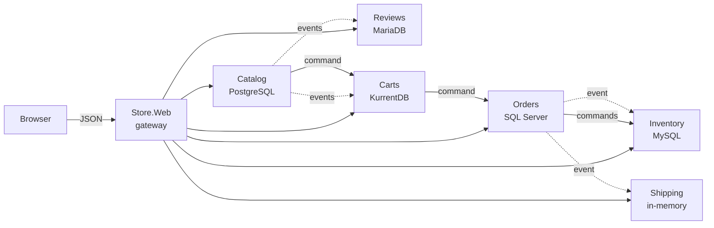

[← Back to Documentation](../../docs/Index.md)

# Store Demo

A small storefront built as six microservices behind a CQRS gateway. Each service owns its own data store, and browser pages call the gateway with Zerra's front end scripts. It runs with nothing installed: databases and message brokers are used when they're available and replaced by in-memory stores and direct calls when they're not.


```mermaid
flowchart LR
    Browser["Browser"] -- JSON --> Web["Store.Web<br/>gateway"]
    Web --> Catalog["Catalog<br/>PostgreSQL"]
    Web --> Inventory["Inventory<br/>MySQL"]
    Web --> Orders["Orders<br/>SQL Server"]
    Web --> Reviews["Reviews<br/>MariaDB"]
    Web --> Shipping["Shipping<br/>in-memory"]
    Web --> Carts["Carts<br/>KurrentDB"]
    Orders -- commands --> Inventory
    Orders -. event .-> Inventory
    Orders -. event .-> Shipping
    Catalog -. events .-> Carts
    Catalog -. events .-> Reviews
    Catalog -- command --> Carts
    Carts -- command --> Orders
```

Solid lines are queries and commands, dotted lines are events. Services also query each other, for example Orders, Reviews, and Carts all read products from Catalog. Service-to-service traffic is binary and encrypted, over TCP, or over HTTP for Shipping, which is hosted in ASP.NET Core. Traffic to and from Catalog is also compressed with Deflate, since its product lists and CSV export and import are large; the other messages are too small to gain from it.

## Run It

**Visual Studio (17.11 or later):** choose the **Store Demo (In Memory, Direct Messaging)** launch profile and press F5. All seven projects start and the browser opens `http://localhost:5100`. No databases or brokers are needed.

**Script:**

```powershell
.\Demo\Store\start-store.ps1                    # use databases and brokers when they're reachable
.\Demo\Store\start-store.ps1 -InMemory          # skip the databases
.\Demo\Store\start-store.ps1 -DirectMessaging   # skip the message brokers
```

To run the real databases and brokers in Docker, use `Demo/Infrastructure/start-infrastructure.ps1`, then pick the **Store Demo (Databases, Message Brokers)** profile or run the script without flags.

## Things to Try

- **Order 3 Standing Desks.** Only 2 are in stock, so Inventory rejects the order and the error comes back through Orders and the gateway to the page.
- **Place and ship an order.** One `OrderShippedEvent` has Inventory take the units off the shelf and Shipping create the shipment. Each service's window logs its handler running once.
- **Change a product's price** with an item in a cart. Catalog sends an event so every Carts replica drops its cached product, and a command so the carts are repriced once. The cart then shows the new price and a Repriced event in its history.
- **Fill a cart and check out.** The Carts page shows every event in the cart's stream, and the order appears on the Orders page.
- **Export the catalog as CSV**, edit it, and preview it as an import. The file streams from the browser through the gateway to Catalog.
- **Stop a service** and see how the failure surfaces in the pages.

## Where to Look

| Feature | Where |
|---|---|
| Browser gateway | `Store.Web/Program.cs` |
| A service: handlers, server, clients to other services | `Store.*.Service/Program.cs` |
| Handlers | `Store.*.Service/Handlers/` |
| Command with a result, awaited across services | `ReserveStockCommand` from Orders to Inventory |
| One change that needs both a command and an event | `CatalogCommandHandler.Handle(ChangeProductPriceCommand)` |
| Event handled on every replica (`PerReplica`) | `Store.Carts.Service/Handlers/CatalogEventHandler.cs`, which drops the replica's cached product |
| Event handled once per service (`PerService`) | `OrderShippedEvent`, subscribed in `Store.Inventory.Service` and `Store.Shipping.Service` |
| Service hosted in ASP.NET Core instead of TCP | `Store.Shipping.Service/Program.cs` |
| Message brokers with a fallback to direct calls | `Program.cs` in Orders, Inventory, Shipping, Reviews, and Store.Web |
| Event sourcing with `AggregateRoot` | `Store.Carts.Service/Aggregates/CartAggregate.cs` |
| Repository with a database per service and in-memory fallback | `Store.*.Service/Data/`, `Store.Common/Data/DataStoreSetup.cs` |
| Streaming queries, download and upload | `ICatalogQueryHandler.ExportProductsCsv` and `PreviewProductImport` |
| Browser calls with generated clients | `Store.Web/wwwroot/js/` |
| Handler tests on an in-memory bus | `Store.*.Test` |

Why each message is a command or an event is explained in [Command or Event?](../../docs/Agents.md#command-or-event-read-this-first) and [Events](../../docs/Events.md#choosing-per-replica-or-per-service). The cart's own stream events are aggregate events, not bus messages; see [Events](../../docs/Events.md#aggregate-events-are-not-cqrs-events).

## Message Brokers

Three flows use a broker each when it's running, and fall back to direct calls when it isn't. Queries always go direct.

| Flow | Broker |
|---|---|
| Orders → Inventory: reserve and release stock (commands) | Kafka |
| Catalog → Carts, Reviews: price changed, discontinued (`PerReplica` events) | RabbitMQ |
| Orders → Inventory, Shipping: order shipped (`PerService` event) | RabbitMQ |
| Gateway → Reviews: submit review (command with a result) | Azure Service Bus (emulator) |

Each service checks its brokers at startup and logs the route it chose. Both ends of a flow make the same check, so they pick the same route. If a broker starts or stops while the services are running, restart the services on both ends of that flow.

## Data Stores

Each service tries its database first and falls back to an in-memory store, logging why. With a database, it creates the schema on startup. Seeding only runs on an empty store. The Overview page shows which store each service is using.

| Service | Database | Default connection |
|---|---|---|
| Catalog | PostgreSQL | `Host=localhost;Port=5432;User ID=postgres;Password=password123;Database=zerrastorecatalog` |
| Inventory | MySQL | `Server=localhost;Port=3306;Uid=root;Pwd=password123;Database=ZerraStoreInventory` |
| Orders | SQL Server | `Data Source=.;Initial Catalog=ZerraStoreOrders;User ID=sa;Password=Password123`, then Windows authentication |
| Reviews | MariaDB | `Server=localhost;Port=3307;Uid=root;Pwd=password123;Database=ZerraStoreReviews` |
| Shipping | none, in-memory by design | — |
| Carts | KurrentDB (event store) | `http://localhost:2113`, without TLS |

## Settings

Defaults are in `Store.Common/StoreSettings.cs`. Override them with environment variables:

| Variable | Default |
|---|---|
| `STORE_IN_MEMORY`, `STORE_DIRECT_MESSAGING` | not set; `true` skips the databases or brokers |
| `STORE_CATALOG_URL` … `STORE_CARTS_URL` | `localhost:9101` to `localhost:9106`; Shipping is `http://localhost:9105` |
| `STORE_CATALOG_POSTGRESQL`, `STORE_INVENTORY_MYSQL`, `STORE_ORDERS_MSSQL`, `STORE_ORDERS_MSSQL_WINDOWS_AUTH`, `STORE_REVIEWS_MARIADB`, `STORE_CARTS_KURRENTDB` | the connection strings above |
| `STORE_KAFKA`, `STORE_RABBITMQ`, `STORE_AZURESERVICEBUS` | `localhost:9092`, `localhost`, the emulator in `Demo/Infrastructure` |
| `STORE_SHARED_KEY` | the demo encryption key |

## Tests

Each service has a test project, `Store.Catalog.Test` through `Store.Carts.Test`. Each builds a bus the way the service does, with its real handlers on a fresh in-memory store and small fakes for the services it calls, so no database, broker, or other service needs to be running. Run them from Test Explorer or run the built test exe.

## Native AOT

Every project sets `<PublishAot>true</PublishAot>`.

```powershell
.\Demo\Store\publish-store-aot.ps1            # publishes all seven to .\Demo\Store\publish\
.\Demo\Store\start-store-aot.ps1 -InMemory    # starts the published executables
```

Zerra and the Store projects publish with no trim or AOT warnings. Some database and broker client libraries aren't trim-annotated; the services that use them suppress those rolled-up warnings, with a comment naming the package.

## Regenerating the JavaScript Models

`Store.Web/wwwroot/js/JavaScriptModels.js` is generated from the `*.Domain` projects by `JavaScriptModels.tt`. Visual Studio runs the template when it's saved.

## Simplifications

This is a demo, so it leaves out things a production system needs:

- The gateway has no `ICqrsAuthorizer` and allows every origin. See [Security](../../docs/Security.md).
- Follow-up messages are sent after saving, without an outbox, so a service that is down misses them.
- A price change replays every cart to find the ones holding the product, where a real system would keep a projection.
- Inventory serializes stock changes with an in-process lock, which only works for a single instance.
